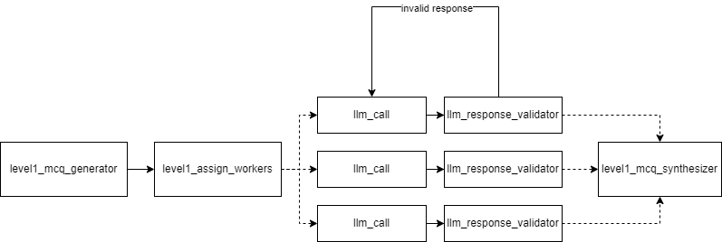
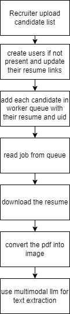
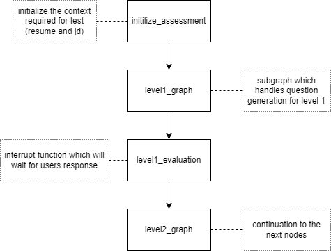

# AI-Powered Technical Assessment Platform

This platform uses LangGraph and LLM technology to create adaptive technical assessments for candidates based on job descriptions and resumes.

## Quick Setup

1. **Install Dependencies**

   ```bash
   pip install -r requirements.txt
   ```

2. **Configure Environment Variables**
   Create a `.env` file in the project root:

   ```
   OPENAI_API_KEY=your-openai-key
   SENDGRID_API_KEY=your-sendgrid-key  # Optional for email notifications
   SENDGRID_SENDER_EMAIL=your-email@example.com  # Optional
   ```

3. **Run the Application**
   ```bash
   uvicorn app.main:app --reload
   ```
   The API will be available at `http://localhost:8000`

## LangGraph Architecture

The core of this platform is a multi-level assessment workflow implemented with LangGraph, designed to provide adaptive technical assessments based on job requirements and candidate qualifications.

### Technical Architecture Diagrams

#### Level 1 Assessment Flow


_Diagram shows the question generation process with level1_mcq_generator, worker assignment, LLM calls, response validation, and question synthesis_

#### Resume Processing Workflow


_Diagram shows the pipeline from recruiter upload through candidate database updates, PDF processing, and text extraction_

#### Main Assessment Graph


_Diagram illustrates the context initialization, assessment initialization, level progression, and evaluation cycles_

### LangGraph Component Structure

The LangGraph implementation is structured in layers:

1. **Models** (`app/langgraph/models.py`):

   - `UserState`: Core state object containing all assessment data
   - `JobDescription`: Job requirements and details
   - `Resume`: Candidate qualifications and experience
   - `Question` & `LevelProgress`: Assessment tracking

2. **Graph Definitions** (`app/langgraph/graph/`):

   - `main.py`: Orchestrates overall assessment flow
   - `level1.py`, `level2.py`, `level3.py`: Individual assessment level graphs

3. **Node Implementations** (`app/langgraph/nodes/`):
   - Each node handles specific operations like:
     - Question generation
     - Answer evaluation
     - Level progression logic

## State Management with LangGraph Checkpointing

A crucial aspect of this application is how it bridges the gap between **LangGraph's stateful nature** and our **stateless REST API architecture**.

### Checkpointing System


_The assessment workflow maintains state across API requests through LangGraph's checkpointing system_

LangGraph is inherently stateful, maintaining conversational context and assessment progress through a graph-based execution flow. However, our platform exposes this functionality through a traditional stateless REST API. To solve this architectural challenge, we use LangGraph's built-in checkpointing system:

1. **Persistent State Storage**

   - All assessment states are stored in `checkpoints.sqlite3` database files
   - Each user session has a unique trace ID that maps to its full state
   - This allows the REST API to be stateless while the underlying assessment remains stateful

2. **State Recovery Between Requests**

   ```python
   # Initialize graph with persistent storage
   graph = StateGraph(UserState)
   # Configure checkpointer with SQLite storage
   checkpointer = SqliteSaver(f"checkpoints.sqlite3")
   # Create a stateful application with persistence
   app = graph.compile(checkpointer=checkpointer)
   ```

3. **Request/Response Flow**
   - API request contains a session identifier
   - The system retrieves the relevant checkpoint based on this identifier
   - LangGraph resumes execution from the saved state
   - Assessment progression is saved back to the checkpoint after processing
   - The stateless API returns only the relevant response data

This architecture provides several advantages:

- **Horizontal Scalability**: Multiple API servers can access the same checkpoints
- **Fault Tolerance**: Assessment progress is not lost if a server instance fails
- **Session Continuity**: Candidates can pause and resume assessments at any point
- **Efficient Resource Usage**: Server memory isn't consumed by inactive sessions

## Key Workflow Details

### Level 1: Technical Skill Matching

- Skill gap analysis between job description and resume
- Multiple-choice question generation targeted at required skills
- Response evaluation with detailed feedback
- Level progression decision based on performance

### Level 2: Advanced Scenario Questions

- Review of candidate's skill profile from Level 1
- Generation of scenario-based questions for deeper technical assessment
- Technical evaluation with code analysis where appropriate
- Level 3 unlock logic based on demonstrated problem-solving ability

### Level 3: System Design Challenges

- Architecture problem generation aligned with job requirements
- Solution evaluation based on system design principles
- Final assessment for senior-level positions

## Demonstration Instructions

To run a demonstration of the LangGraph assessment workflow:

1. **Update Environment Variables**
   Ensure your `.env` file contains a valid OpenAI API key

2. **Run the Standalone Demonstration**

   ```bash
   python test.py
   ```

3. **Review Assessment Results**
   The demonstration will show the progression through assessment levels based on the inputs.

## Resume Processing Integration

The platform also includes an asynchronous resume processing service that:

1. Downloads candidate resumes from Google Drive
2. Converts PDF content to text using OpenAI's Vision API
3. Updates the candidate profile with extracted information
4. Feeds this data into the LangGraph assessment flow
